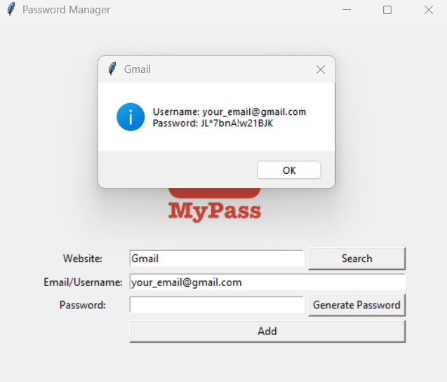
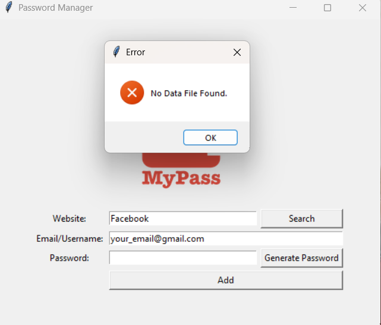
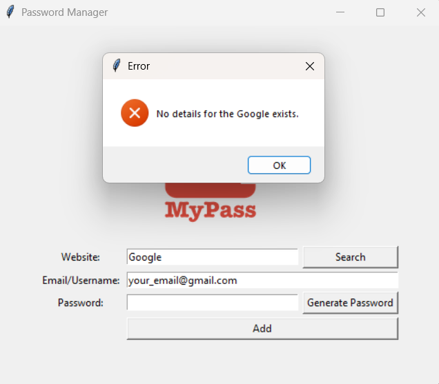
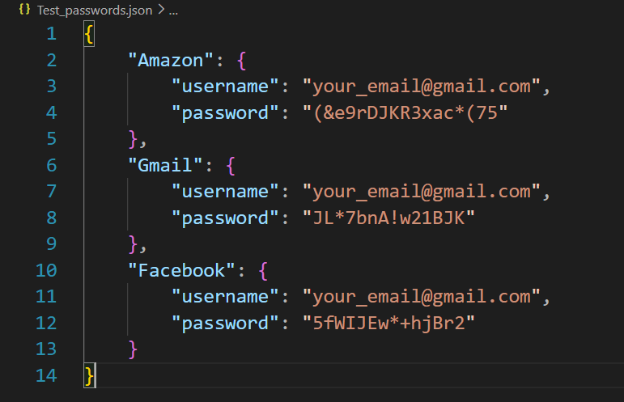

# MyPass - Password Manager


MyPass is a beginner-friendly desktop password manager built with Python and Tkinter. It can generate strong random passwords, copy generated passwords to the clipboard, save login details locally in a JSON file, and search saved credentials by website name.

> ⚠️  Security Note: This project stores passwords in a local `.json` file for learning/demo purposes. For production use, password data should be encrypted before storage.

## 📸 Screenshots

| Main Window | Generated Password |
| --- | --- |
|  |  |

| Empty Fields Validation | Save Confirmation |
| --- | --- |
|  |  |

| Search Result | Missing Data File |
| --- | --- |
|  |  |

| Website Not Found | Saved Credentials JSON |
| --- | --- |
|  |  |

## ✨ Features

- Generate strong randomized passwords using letters, numbers, and symbols.
- Automatically copy generated passwords to the clipboard with `pyperclip`.
- Save credentials locally in `Test_passwords.json`.
- Store data in structured JSON grouped by website name.
- Search for saved credentials by website.
- Show a clear message when a website is not found.
- Show a clear error when the data file does not exist yet.
- Validate empty website, username, and password fields before saving.
- Show a confirmation popup before writing credentials to the JSON file.
- Use a default email/username value to speed up repeated entries.
- Clear the website and password fields after saving, then return focus to the website field.

## 🛠️ Tech Stack

- **Python** - core programming language
- **Tkinter** - built-in GUI library
- **Pyperclip** - clipboard support for generated passwords
- **JSON** - local structured credential storage

## ⚙️ How It Works

1. Enter the website name and email/username.
2. Click **Generate Password** to create a random password.
3. The password is inserted into the password field and copied to the clipboard.
4. Click **Add** to review the entered details in a confirmation popup.
5. If you confirm, the credentials are saved in `Test_passwords.json`.
6. If `Test_passwords.json` already exists, the app loads the existing data and updates it.
7. If the same website name already exists, the saved username and password for that website are replaced with the newest values.
8. Click **Search** after entering a website name to view saved credentials for that website.

Generated passwords include:

- Uppercase and lowercase letters
- Numbers
- Symbols
- Shuffled character order

## 📦 Installation

### 1. Clone the Repository

```bash
git clone https://github.com/seiffayed/Password_Manager.git
cd Password_Manager
```

### 2. Install Requirements

Tkinter is included with most Python installations, but `pyperclip` must be installed manually:

```bash
pip install pyperclip
```

### 3. Run the App

```bash
python main.py
```

## 📁 Project Structure

```text
Password_Manager/
|-- assets/
|   `-- screenshots/
|       |-- main-window.png
|       |-- generated-password.png
|       |-- empty-fields-validation.png
|       |-- save-confirmation.png
|       |-- search-result.png
|       |-- no-data-file.png
|       |-- website-not-found.png
|       `-- saved-credentials-json.png
|-- main.py
|-- logo.png
|-- Test_passwords.json
|-- README.md
|-- LICENSE
`-- .gitignore
```

## 🧪 Validation and Error Handling

MyPass includes simple validation and error handling:

- If the website, username, or password field is empty, the app displays an error message.
- Before saving, the app shows a confirmation dialog so users can review the entered credentials.
- If the user searches without entering a website, the app asks for a website name.
- If the user searches before any JSON data file exists, the app shows a missing data file error.
- If the searched website does not exist in the JSON data, the app shows a not-found message.
- After a successful save, the website and password fields are cleared.

## Data Format

Saved credentials are stored in `Test_passwords.json` using this structure:

```json
{
  "Amazon": {
    "username": "your_email@gmail.com",
    "password": "(&e9rDJKR3xac*(75"
  },
  "Gmail": {
    "username": "your_email@gmail.com",
    "password": "JL*7bnA!w21BJK"
  }
}
```

## 🎓 Credits

This project is part of the **100 Days of Code: The Complete Python Pro Bootcamp** learning path.

## 📄 License

This project is licensed under the MIT License. See the `LICENSE` file for details.

## 🙌 Author

Built by **SeiF Fayed** as a Python Tkinter project for managing, generating, saving, and searching passwords locally.
