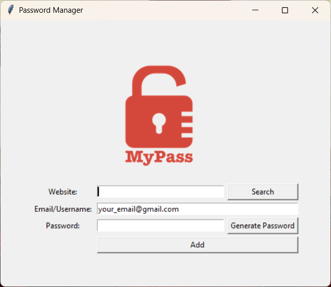
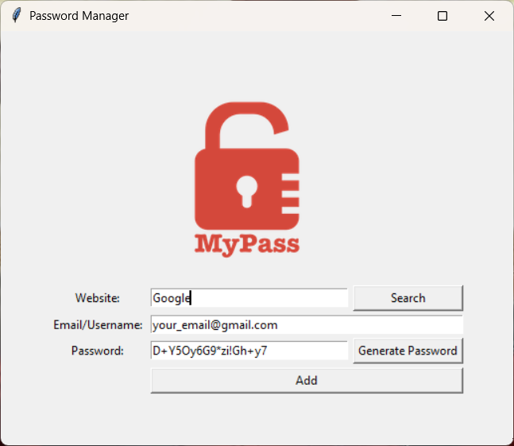
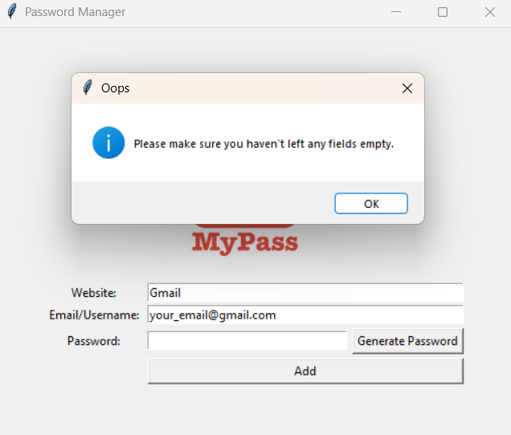
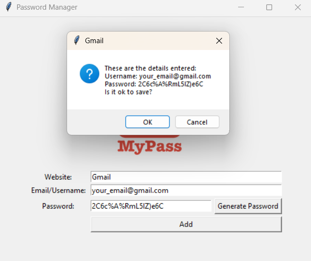
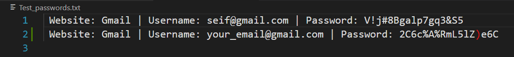

# MyPass - Secure Password Manager


MyPass is a simple, desktop-based **Password Manager & Generator** built with Python and Tkinter. It helps users create strong randomized passwords, copy them automatically to the clipboard, and store saved login details locally in a text file.

> ⚠️ This project stores passwords in a local `.txt` file for learning/demo purposes. For production use, password data should be encrypted before storage.

## 📸 Screenshots

| Main Window | Generated Password |
| --- | --- |
|  |  |

| Empty Fields Validation | Save Confirmation |
| --- | --- |
|  |  |

### Saved Credentials File



## ✨ Features

- 🔐 **Strong password generation** using random letters, numbers, and symbols
- 📋 **Automatic clipboard copying** with `pyperclip`
- 💾 **Local data storage** in a text file
- 🖥️ **User-friendly Tkinter GUI** with clear input fields and buttons
- ✅ **Input validation** to prevent saving empty website, username, or password fields
- 🧾 **Confirmation pop-up** before saving entered credentials
- 🎯 **Default username/email field** for faster data entry

## 🛠️ Tech Stack

- **Python** - Core programming language
- **Tkinter** - Built-in Python GUI library
- **Pyperclip** - Clipboard management for generated passwords

## ⚙️ How it Works

1. Enter the website name and email/username.
2. Click **Generate Password** to create a strong randomized password.
3. The generated password is inserted into the password field and copied to your clipboard automatically.
4. Click **Add** to save the credentials.
5. MyPass checks that no fields are empty.
6. A confirmation pop-up displays the entered details before saving.
7. If confirmed, the credentials are appended to `Test_passwords.txt`.

Generated passwords include:

- Uppercase and lowercase letters
- Numbers
- Symbols
- Shuffled character order for better randomness

## 📦 Installation

### 1. Clone the repository

```bash
git clone https://github.com/seiffayed/Password_Manager.git
cd Password_Manager
```

### 2. Install the required package

Tkinter is included with most Python installations, but `pyperclip` must be installed manually:

```bash
pip install pyperclip
```

### 3. Run the application

```bash
python main.py
```

## 📁 Project Structure

```text
Password_Manager/
├── assets/
│   └── screenshots/
│       ├── main-window.png
│       ├── generated-password.png
│       ├── empty-fields-validation.png
│       ├── save-confirmation.png
│       └── saved-credentials-file.png
├── main.py
├── logo.png
├── Test_passwords.txt
├── README.md
├── LICENSE
└── .gitignore
```

## 🧪 Validation & Error Handling

MyPass includes basic validation to improve reliability:

- If the website, username, or password field is empty, the app displays an error message.
- Before saving, the app shows a confirmation dialog so users can review the entered credentials.
- After a successful save, the input fields are cleared and the default username placeholder is restored.

## 🔒 Security Note

This project is intended as a beginner-friendly Python GUI project. Since credentials are stored in plain text, avoid using it for real accounts unless encryption or a secure database is added.

## 🎓 Credits

This project is a part of the **"100 Days of Code: The Complete Python Pro Bootcamp"**.

## 📄 License

This project is licensed under the MIT License. See the `LICENSE` file for details.

## 🙌 Author

Built by **SeiF Fayed** as a Python Tkinter project for managing and generating passwords locally.
